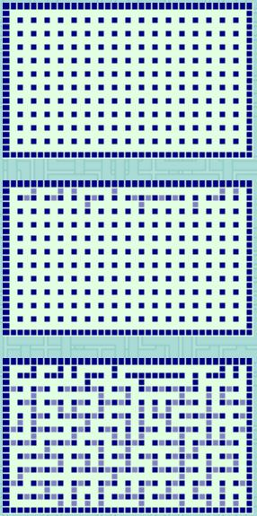
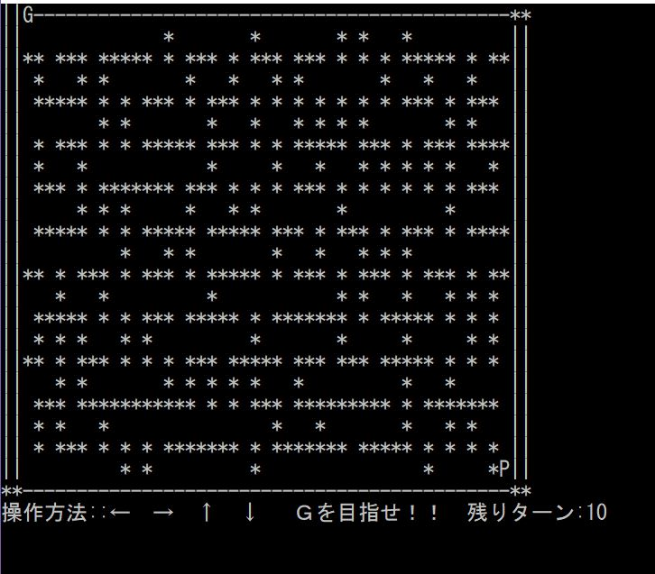
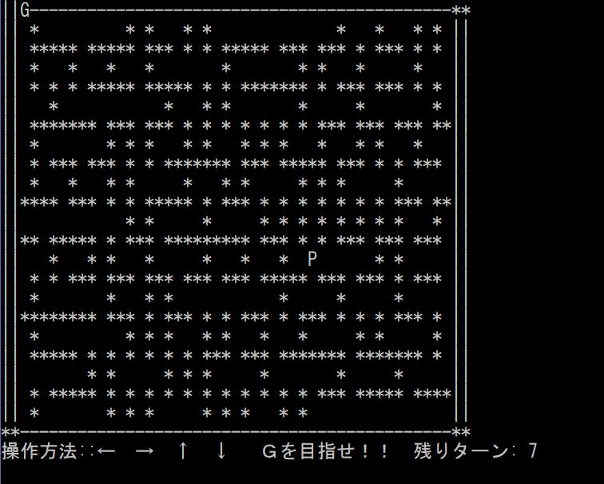

# GameTitle
Game_Labyrinth

# 開発環境(Development Tools)
+ Visual Studio 2019 community

# 開発言語(Programming Language)
+ C

# 操作方法(Operate)
+ 移動(Move):
↑　↓　←　→

+ 決定(Enter):
Enter Key

# 迷路の自動生成
棒倒し法という方法を使用。

外壁を設置した後、内壁を2マスおきに等間隔で設置内壁を上下左右のどちらかに倒す事で迷路が生成されます。

ゲームを実行するたびに
自動生成されるので毎回違った
バリエーションを楽しめます

